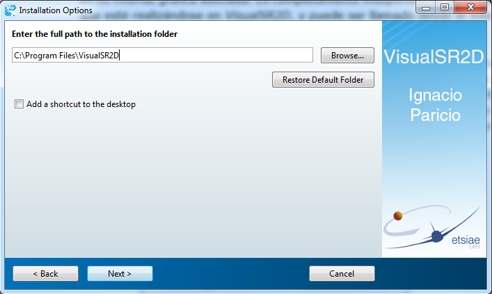

# vsr2d
## Description
Visual Surface Roughness 2D (vsr2d) is an app to conduct surface roughness analyses on aerospace grade surfaces.

## Development
vsr2d was developed during the spring of 2010 as part of my Bachelor's thesis.

## Requirements
vsr2d is developed in MATLAB and requires MATLAB Compiler Runtime (MCR). Recommended version is 8.3 (R2014a).

## Files
* app: Windows x32 and x64 installers for vs2rd GUI
* src: MATLAB source code
* data_NIST: sample 2D surface roughness profiles from the [NIST](https://www.nist.gov/)
* resources: various images and icons

## Screenshots
Installer

Empty interface

Loaded profile

Details on Gaussian filter

Embedded `smd` generator

